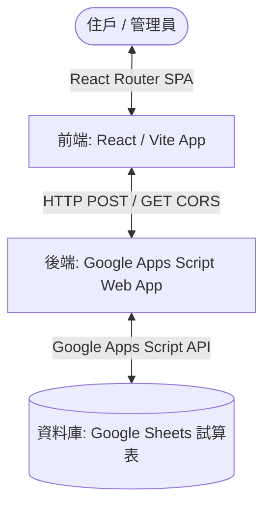

# 社區資訊看板專案開發與設計指南 (DEVELOPMENT_GUIDE.md)

> [!IMPORTANT]
> **本文件為本專案的最高開發規範。**
> 未來進行任何功能疊代、頁面新增或後端 API 異動時，開發人員**必須首先閱讀並嚴格遵守**本指南中所列的設計限制與控制邏輯。

---

## 1. 系統架構概覽 (System Architecture)

本專案採用輕量且高效的無伺服器 (Serverless) 架構，以 Google 生態系作為後端支援：



*   **前端應用**：基於 React 18 與 Vite 建構的單頁應用程式 (SPA)。
*   **後端服務**：部署為 Web 應用程式的 Google Apps Script (GAS) 程式碼 (`Code.gs`)。
*   **資料儲存**：以 Google Sheet (Google 試算表) 作為資料庫，包含「公佈欄資料」、「工程詢價資料」等工作表。

---

## 2. 參數設定與環境變數 (Configuration)

### 前端環境變數
前端使用 Vite 的環境變數機制，所有環境變數必須以 `VITE_` 開頭：
*   **檔名**：`.env` 或 `.env.local`
*   **關鍵參數**：
    *   `VITE_GAS_URL`：指向部署好的 Google Apps Script Web App 網址。
        *   *範例*：`VITE_GAS_URL=https://script.google.com/macros/s/AKfycb.../exec`

### 後端設定
*   **SHEET_ID**：在 `Code.gs` 中設定的 Google 試算表 ID。
*   **工作表名稱**：
    *   `公佈欄資料`：存放一般公告、活動、會議與工程公告。
    *   `工程詢價資料`：存放詢價單與廠商報價明細。
    *   `系統設定` 或 `Log`：存放系統操作紀錄與基礎設定。

---

## 3. 前後端通訊規範 (API Protocol)

由於 Google Apps Script Web App 在處理跨網域 (CORS) 請求時有其特殊限制，專案通訊遵循以下協議：

> [!CAUTION]
> **CORS 繞過限制：**
> GAS 不支援標準的 CORS 預檢請求 (Preflight Request, OPTIONS)。因此，前端在發送 POST 請求時，**必須**將 Content-Type 設為 `text/plain;charset=utf-8`，並將 JSON payload 轉為字串發送。後端 GAS 再手動解析字串。

### 前端通訊介面 (`src/services/api.js`)
*   **GET 請求**：參數附加於 URL Query String 中。後端藉由 `doGet(e)` 接收，並根據 `action` 參數進行路由。
*   **POST 請求**：將 `action` 與資料封裝於 body 中。後端藉由 `doPost(e)` 接收並解構。

```javascript
// POST 傳送規範範例
const response = await fetch(GAS_URL, {
  method: 'POST',
  headers: {
    'Content-Type': 'text/plain;charset=utf-8', // 必須為 text/plain
  },
  body: JSON.stringify({ action: 'editBulletin', ...data }),
});
```

---

## 4. 關鍵控制邏輯 (Control Logic)

### A. 公告有效性過濾邏輯 (Bulletin Filtering)
首頁及公告列表在載入資料時，必須依據時間與類別進行過濾：
1.  **狀態檢查**：排除狀態欄位為 `'D'` 的公告（代表已軟刪除）。
2.  **一般公告（公告、活動、會議、其他）**：
    *   **開始時間限制**：必須 `開始日期 + 開始時間 <= 現在時間`。
    *   **過期限制**：必須 `結束日期 + 結束時間 >= 現在時間`，過期公告不予顯示。
3.  **工程公告 (特別規則)**：
    *   工程進度不受上述有效時間限制，永遠視為有效，直到狀態變更為「已完成」、「已結案」或被軟刪除。

### B. 詢價與投票邏輯 (Inquiry & Vote)
*   **新增詢價**：當新增詢價時，後端會自動在「工程詢價資料」工作表寫入一筆新詢價單，並預設狀態為「新單」。
*   **投票與報價**：允許為各詢價項目登錄多廠商報價（包含附件檔案雲端網址），並支持管理員與住戶進行比價投票。

### C. 軟刪除與日誌機制 (Soft Delete & Log)
*   專案內所有刪除操作（公告、詢價、報價）**均為軟刪除 (Soft Delete)**。
*   執行刪除時，將對應資料列的 `status` 欄位更新為 `'D'`。
*   每次異動時，後端會同步將「操作人」、「操作時間」及「操作行為」寫入日誌工作表。

---

## 5. 設計限制與規範 (Design Constraints)

為了確保看板在社區大廳電視牆、住戶手機及電腦瀏覽器上皆能完美呈現，疊代開發時請遵守以下 UI/UX 限制：

### A. 檔案編碼與格式要求
*   **檔案編碼**：所有 `.cs`、`.cshtml` 以及 `.jsx`、`.js` 檔案，若含有中文字元，建議存為 **UTF-8 with BOM (65001)**，以防在 Windows 伺服器或特定瀏覽器上出現亂碼。
*   **換行符號**：統一使用 **Windows (CRLF)** 換行符。
*   **註解規範**：所有程式碼內的註解與文檔說明**必須使用繁體中文 (zh-TW)**，變數與函式命名維持英文。

### B. 路由與另開分頁規範
*   專案已設定 `basename="/bulletin_board_googleSheet"`。
*   在前端 Modal（如「其他項目」的 7 合 1 卡片選單）中導向特定功能頁面時，若需要「另開分頁」，**必須使用 React Router 的 `<Link to="..." target="_blank">`**。
*   *原因*：這能確保 React Router 自動將 `basename` 拼接到 URL 最前面，並維持 SPA 路由的連貫性。避免直接寫死絕對路徑。

### C. 雙重滾動條防範 (Scrollbar Management)
*   若自訂頁面內容嵌入在 `Modal` 元件中，**切勿**在子內容容器上設定 `maxHeight` 與 `overflowY: 'auto'`。
*   *原因*：`Modal.css` 中的 `.modal-body` 已經預設了滾動區域。如果在子容器中再次設定，會導致視窗右側同時出現兩條滾動條，破壞美感。

### D. 建議版型擴充美感 (Aesthetics)
所有新增的功能頁面版型必須保持 Premium 質感：
*   **主題 Banner**：頂部必須使用 135 度線性漸層（例如 `linear-gradient(135deg, #14b8a6, #0f766e)`），並搭配高對比的白色文字。
*   **互動反饋**：按鈕在 `hover` 與 `active` 時必須有縮放或顏色漸變的微動畫；表單提交成功時必須跳出專屬的 Modal 或提示條。
*   **資料填充**：不使用 Lorem Ipsum 等 placeholder，必須設計貼近真實社區的情境資料（例如：KTV預約、黑貓包裹單號、瓦斯度數趨勢）。

---

## 6. 其他項目擴充頁面清單 (Additional Pages)

目前在首頁點擊「其他項目」時會彈出 7 合 1 選單，以下為各自對應的頁面組件與路由：

| 功能名稱 | 對應路由 | 檔案路徑 | 設計主題色系 |
| :--- | :--- | :--- | :--- |
| **線上報修** | `/repair` | `src/pages/RepairPage.jsx` | 琥珀金至工程橘 (`#f59e0b` ➜ `#d97706`) |
| **瓦斯回報** | `/gas` | `src/pages/GasPage.jsx` | 火焰橘至烈焰紅 (`#f97316` ➜ `#ef4444`) |
| **公設預約** | `/booking` | `src/pages/BookingPage.jsx` | 湖水綠至深松石 (`#14b8a6` ➜ `#0f766e`) |
| **包裹查詢** | `/package` | `src/pages/PackagePage.jsx` | 靛藍至紫羅蘭 (`#6366f1` ➜ `#4f46e5`) |
| **訪客登記** | `/visitor` | `src/pages/VisitorPage.jsx` | 玫瑰粉至珊瑚橘 (`#f43f5e` ➜ `#f97316`) |
| **下載區** | `/download` | `src/pages/DownloadPage.jsx` | 經典藍至深寶藍 (`#3b82f6` ➜ `#1d4ed8`) |
| **討論區** | `/forum` | `src/pages/ForumPage.jsx` | 科技暗色系背景 + 磨砂玻璃 (Glassmorphism) |
